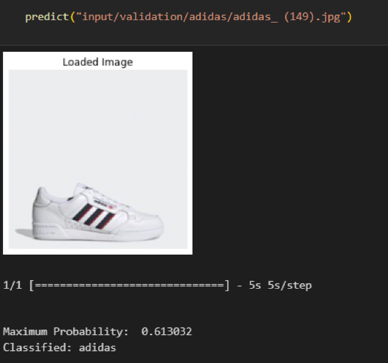

# Shoe-Brand-Classification

The project consist of making classification betweeen 3 differents brands of shoes (Nike, Adidas & Converse).  
Master 1 project made for the Convex and Optimization cursus at Efrei Paris.  
Made by Da Cruz Mathis, Sivananthan Sarankan and Sebastiao-Esteves Kevin.  

Here, an example of prediction made by the model :  

